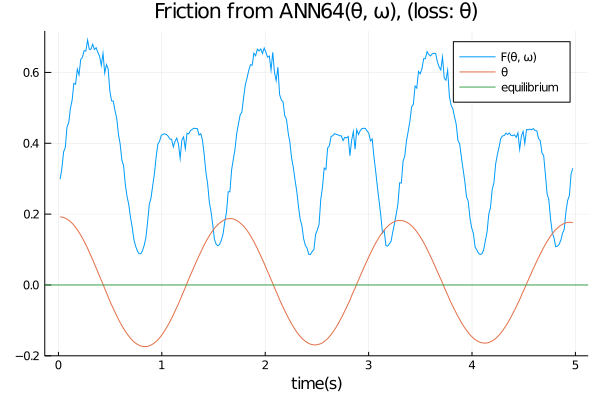

# FrictionLearner
Learning the friction of a non-trivial damping pendulum with hinge friction using Neural Networks (insight from Universal Differential Equations (UDE))

Simple pendulum experiment is a well known study case in classical physics. In real world pendulum experiments, there exsists non-conservative friction forces and drag forces associated with the equation of motion. In that case, the pendulum undego "damping"; a complex phenomenon which is quite difficult to model. We use the new approach explained in [1] by using neural networks in the form of Universal Differential Equations (UDEs) to learn the complicated friction forces associated with the damping motion. We use OPEN CV to extract the data from video frames of a real damping pendulum experiment and use that data for the training-testing process.

[1] Rackauckas et. al, Univeral Differential Equatins for Scientific Machine Learning. (https://arxiv.org/abs/2001.04385)

This work is part of the paper "Discovering Nonlinear Dynamics Through Scientific Machine Learning" whcih is accepted for the Intelligence Systems Conference (IntelliSys-2021), Amsterdam, Netherlands, 2021. Conference link can be found [here](https://saiconference.com/IntelliSys).

 ### Learned friction(F(&theta;, &omega;)) as a function of time(t) using the simulated data:
 
 

  
 

 ### Learned friction(F(&theta;, &omega;)) as a function of time(t) using real data from the pendulum experiment:
 
 

  
 

 
